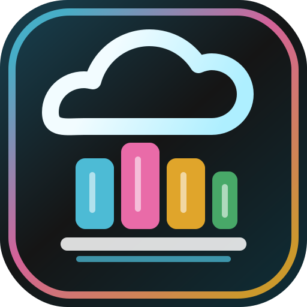

<p align="center">
  
</p>

# 📚 Collectarr App

[](LICENSE)

[](https://github.com/collectarr/collectarr-app/issues)


> A local-first, CLZ-inspired collection manager for serious collectors.

Collectarr keeps your personal library local, fast, and offline-friendly, while
using `collectarr-core` for canonical metadata and `collectarr-sync` for
optional multi-device sync.

## ✨ Why Collectarr

- 🗂️ **Local-first ownership** — your owned/wishlist state lives in the app
- 🧩 **9 active media kinds** — comics, manga, anime, books, games, board games, movies, TV, music
- 🛠️ **Collector workflows** — variants, barcode, bulk edit, custom fields, import/export
- 🔍 **Provider-backed metadata** — rich metadata via Core provider integrations
- 🧪 **Power-user/admin tooling** — ingest, proposals, provider health, image cache controls

## 🚀 Highlights

- 📦 Offline Drift database with cached catalog snapshots
- 🖼️ CLZ-style workspace (grid/table/carousel, filters, sidebars, inspector)
- ➕ Smart add/search flows with provider previews and bundle-aware anchors
- 🎵 Media-aware edit/inspector UX (music/game/video specific fields)
- 🔁 Optional sync support through `collectarr-sync`
- 📊 CSV import/export and TMDB import
- 🎨 Animated accent theming across libraries
- 🧭 Metadata compare flows in edit UX (including context entrypoints for supported kinds)

## ⚡ Quick start

```powershell
flutter pub get
dart run build_runner build
flutter analyze
flutter test
```

### 🌐 Run on web

```powershell
flutter run -d chrome `
  --dart-define=COLLECTARR_API_BASE_URL=http://localhost:8010 `
  --dart-define=COLLECTARR_SYNC_BASE_URL=http://localhost:8020 `
  --dart-define=COLLECTARR_SYNC_KEY=collectarr-sync-dev-key
```

### 🪟 Run on Windows

```powershell
flutter run -d windows
```

## 🧱 Product boundaries

Collectarr App owns:

- local storage and shelf UX
- add/edit/import/export/inspector workflows
- media-aware presentation + desktop ergonomics

`collectarr-core` owns canonical metadata, provider integrations, ingest/admin
logic, and backend media services.

## 🧭 Library parity contract

See [docs/library-parity-contract.md](docs/library-parity-contract.md).

## 🗺️ Roadmap

See [docs/implementation-plan.md](docs/implementation-plan.md).

## 🔒 Release policy

Releases are manual (`workflow_dispatch`). Pushes to `main` run CI only.

Published release assets include:

- GitHub Release notes + tags
- GHCR web image: `ghcr.io/collectarr/collectarr-app-web`
- Android `.apk`
- Windows `.zip` + `.exe`
- macOS `.zip` + `.dmg`
- Linux `.tar.gz` + `.deb`

## 🔗 Related repos

| Repo | Purpose |
|------|---------|
| `collectarr-core` | Canonical metadata catalog, providers, image delivery, admin APIs |
| `collectarr-sync` | Optional personal sync service |

## 💛 Support

[](https://ko-fi.com/saitatter)
