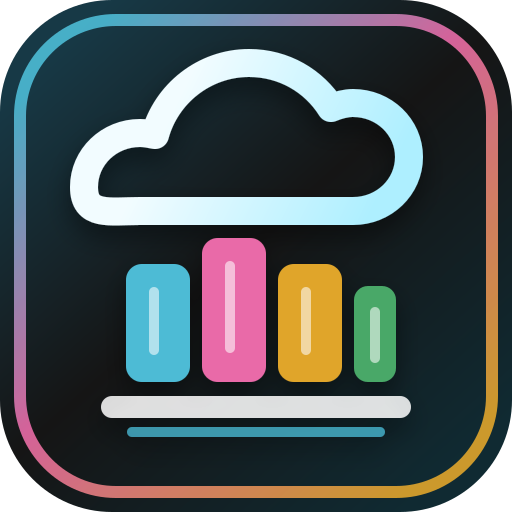

<p align="center">
  
</p>

# 📚 Collectarr App

[](LICENSE)

[](https://github.com/collectarr/collectarr-app/issues)


> A local-first, CLZ-inspired collection manager for serious collectors.
>
> Current releases are treated as pre-1.0 beta releases.

Collectarr keeps your personal library local, fast, and offline-friendly, while
using `collectarr-core` for canonical metadata and `collectarr-sync` for
optional multi-device sync.

> **Coordinated all-kind Catalog Item v1 cutover in progress:** the target is
> one Catalog Item per collectible edition/version/release and zero or more
> separate Owned Copy records. Music has a Core Album API slice, but App storage
> and the other eight kinds still need the coordinated reset. Do not deploy or
> reset existing databases yet. The completed cutover requires fresh App and
> Core databases and a rebuilt Core search index; old database and backup
> formats will not be supported by the final v1 baseline. See the
> [cutover plan](docs/architecture/catalog-item-v1-cutover.md) and
> [field ledgers](docs/architecture/catalog-item-v1-field-ledgers/README.md).

The target keeps kind-specific catalog details and child editors inside the
owning kind, while sharing one Catalog Item / Owned Copy structure across all
nine kinds. The cross-repository cutover is not complete yet.

## ✨ Why Collectarr

- 🗂️ **Local-first ownership** — your owned/wishlist state lives in the app
- 🧩 **9 active media kinds** — comics, manga, anime, books, games, board games, movies, TV, music
- 🛠️ **Collector workflows** — variants, barcode, bulk edit, custom fields, import/export
- 🔍 **Provider-backed metadata** — source mapping and imports owned by App adapters
- 🧪 **Power-user/admin tooling** — ingest, proposals, provider health, image cache controls

## 🚀 Highlights

- 📦 Offline Drift database with cached catalog snapshots
- 🖼️ CLZ-style workspace (grid/table/carousel, filters, sidebars, inspector)
- ➕ Smart add/search flows with provider previews and bundle-aware anchors
- 🎵 Media-aware edit/inspector UX (music/game/video specific fields)
- 🔁 Optional sync support through `collectarr-sync`
- 📊 CSV import/export and TMDB import
- 🎨 Animated accent theming across libraries
- ✨ Cleaner auth/login shell and platform-aware tooling placement
- 🧭 Metadata compare flows in edit UX (including context entrypoints for supported kinds)

## ⚡ Quick start

```powershell
flutter pub get
dart run tool/generate_kind_registries.dart
dart run build_runner build --delete-conflicting-outputs
flutter analyze
flutter test
```

### Local database and seed fixture

The development fixture covers all nine kinds, their typed media/release
graphs, owned data, tracking data, and validated cover images.

```powershell
# Seed the existing local database
dart run scripts/seed_local_db.dart

# Delete the local Drift database, reseed it, and launch Windows
.\scripts\reset_and_run.ps1 -Run -Seed
```

For a browser session with the fixture already loaded:

```powershell
.\scripts\run_web_for_copilot.ps1 -Seed -Route /libraries
```

### 🌐 Run on web

```powershell
flutter run -d chrome `
  --dart-define=COLLECTARR_API_BASE_URL=http://localhost:8010 `
  --dart-define=COLLECTARR_SYNC_BASE_URL=http://localhost:8020 `
  --dart-define=COLLECTARR_SYNC_KEY=collectarr-sync-dev-key
```

### 🪟 Run on Windows

```powershell
flutter run -d windows
```

## 🧱 Product boundaries

Collectarr App owns:

- local storage and shelf UX
- add/edit/import/export/inspector workflows
- media-aware presentation + desktop ergonomics
- canonical in-memory models and semantic behavior for each library kind

`collectarr-core` owns the backend catalog/API contract, provider integrations,
ingest/admin logic, and media services. Provider transport DTOs are decoded
back into the owning kind before they enter app edit, workspace, or persistence
flows.

After kind dispatch, app code keeps the concrete type (`ComicMedia`,
`BookRelease`, `TvSeries`, etc.). Cross-kind screens use structural references
and summaries instead of a universal semantic catalog model.

## 🧭 Library parity contract

See [docs/library-parity-contract.md](docs/library-parity-contract.md).

## 🗺️ Roadmap

See the [current architecture status](docs/architecture/current-status.md),
[kind architecture](docs/architecture/kinds.md), and
[local persistence model](docs/architecture/local-persistence.md).

Active implementation plans:

- [Kind boundary completion](docs/architecture/kind-boundary-completion-plan.md)
- [Add/Edit form unification](docs/architecture/add-edit-form-unification-plan.md)
- [All-kind form and workspace schema reorganization](docs/architecture/kind-schema-reorganization-plan.md)
- [UI readability and contrast](docs/architecture/ui-readability-plan.md)

Current active tracks:

- preserve the manual Add submission guard with contract checks
- reduce generic Add/provider hosts to structural selection and orchestration
- remove obsolete draft, fallback, and widget paths after each migration
- improve small text, accent contrast, and text scaling across Library screens
- keep seed scripts, local Drift schemas, and contract tests synchronized
- keep provider protocol code separate from kind-owned semantic mapping
- extend calendar support with a live subscribable ICS feed and reminders
- add local notifications for loans, releases, sync conflicts, and imports
- keep Plex/Jellyfin/Emby watched sync as a low-priority follow-up to the local watch-session flow
- add a reusable importer framework for MAL, AniList, Trakt, Simkl, and Kitsu personal lists
- simplify `LibraryAddDialog` and its session controller around search, preview, and submit responsibilities
- keep admin proposal/editor UX and stats surfaces aligned with Core contracts

## 🔒 Release & Versioning Policy

Collectarr App uses Semantic Versioning 2.0.0 and configurable update channels (`stable`, `beta`, `nightly`).

See [docs/versioning-policy.md](docs/versioning-policy.md) for full details on versioning rules, update channel semantics, and release verification.

Releases are manual (`workflow_dispatch`). Pushes to `main` run CI only.

Published release assets include:

- GitHub Release notes + tags (`v0.x.y-beta.n`)
- GHCR web image: `ghcr.io/collectarr/collectarr-app-web`
- Android `.apk`
- Windows `.zip` + `.exe`
- macOS `.zip` + `.dmg`
- Linux `.tar.gz` + `.deb`

## 🔗 Related repos

| Repo | Purpose |
|------|---------|
| `collectarr-core` | Canonical metadata catalog, providers, image delivery, admin APIs |
| `collectarr-sync` | Optional personal sync service |

## 💛 Support

[](https://ko-fi.com/saitatter)
