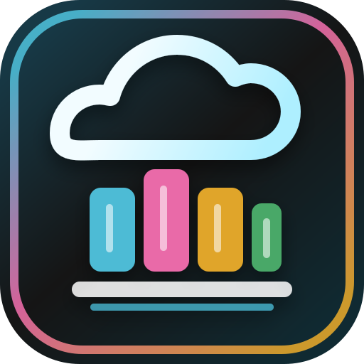

<p align="center">
  
</p>

# 📚 Collectarr App

[](LICENSE)

[](https://github.com/collectarr/collectarr-app/issues)


> A local-first, CLZ-inspired collection manager for serious collectors.
>
> Current releases are treated as pre-1.0 beta releases.

Collectarr keeps your personal library local, fast, and offline-friendly, while
using `collectarr-core` for canonical metadata and `collectarr-sync` for
optional multi-device sync.

The active local record model is one independently editable library entry per
concrete collectible, with `catalog_data` and `personal_data` stored together.
An optional `source_catalog_ref` records Core provenance only. Duplicating an
entry creates a new independent local record. User proposals remain available
and carry the same catalog fields as manual Add/Edit; provider search and
ingest are not part of that flow. See
[the Catalog Item v1 baseline and fresh database policy](docs/architecture/flattened-catalog-baseline.md).

The app keeps semantic behavior inside the owning kind: Comic, Manga, Book,
Game, Board Game, Movie, TV, Anime, and Music each provide their typed domain,
edit flows, persistence integration, and applicable actions.

## ✨ Why Collectarr

- 🗂️ **Local-first ownership** — your owned/wishlist state lives in the app
- 🧩 **9 active media kinds** — comics, manga, anime, books, games, board games, movies, TV, music
- 🛠️ **Collector workflows** — variants, barcode, bulk edit, custom fields, import/export
- 🔍 **Canonical catalog** — search shared Core metadata and create new entries through manual Add
- 🧪 **Power-user/admin tooling** — user proposals, catalog review, and image management

## 🚀 Highlights

- 📦 Offline Drift database with cached catalog snapshots
- 🖼️ CLZ-style workspace (grid/table/carousel, filters, sidebars, inspector)
- ➕ Search Core catalog, enter new catalog metadata manually, or submit it as a proposal for review
- 🎵 Media-aware edit/inspector UX (music/game/video specific fields)
- 🔁 Optional sync support through `collectarr-sync`
- 📊 CSV import/export
- 🎨 Animated accent theming across libraries
- ✨ Cleaner auth/login shell and platform-aware tooling placement
- 🧭 Metadata compare flows in edit UX (including context entrypoints for supported kinds)

## ⚡ Quick start

```powershell
flutter pub get
dart run tool/generate_kind_registries.dart
dart run build_runner build --delete-conflicting-outputs
flutter analyze
flutter test
```

### Local database and seed fixture

The development fixture covers all nine kinds, local library entries, personal
data, tracking data, and validated cover images. Native builds create
`collectarr-library.sqlite` in the application's documents directory when
started against a fresh v1 setup. Keep any existing database and its backups;
the schema has no upgrade path, and reset helpers must not be run against user
data.

For a browser session with the fixture already loaded:

```powershell
.\scripts\run_web_for_copilot.ps1 -Seed -Route /libraries
```

### 🌐 Run on web

```powershell
flutter run -d chrome `
  --dart-define=COLLECTARR_API_BASE_URL=http://localhost:8010 `
  --dart-define=COLLECTARR_SYNC_BASE_URL=http://localhost:8020 `
  --dart-define=COLLECTARR_SYNC_KEY=collectarr-sync-dev-key
```

### 🪟 Run on Windows

```powershell
flutter run -d windows
```

## 🧱 Product boundaries

Collectarr App owns:

- local storage and shelf UX
- add/edit/import/export/inspector workflows
- media-aware presentation + desktop ergonomics
- canonical in-memory models and semantic behavior for each library kind

`collectarr-core` owns the source-neutral catalog/API contract and review of
user proposals. The App owns the complete local entry, its personal fields,
attachments, activity, local storage, and sync payloads. Sync carries the
entry's catalog and personal maps together as one local snapshot; it does not
create a second canonical catalog. Proposals contain the same kind-owned
catalog fields as manual Add/Edit and contain no provider IDs or personal data.

After kind dispatch, app code keeps the concrete kind-owned type for field
semantics. Cross-kind screens use local-entry references and summaries. The
workspace still distinguishes Core Catalog Item rows from local entries while
the remaining derived-reference adapters are consolidated; see the
[current status](docs/architecture/current-status.md) for the exact limits.

## 🗺️ Roadmap

See the [current architecture status](docs/architecture/current-status.md),
[kind architecture](docs/architecture/kinds.md), and
[local persistence model](docs/architecture/local-persistence.md).

Architecture references and remaining implementation tracks:

- [Remaining cleanup audit and implementation sequence (2026-10-02)](docs/architecture/cleanup-audit-2026-10-02.md)
- [Music UI comparison with CLZ and parity implementation plan (2026-10-02)](docs/architecture/music-clz-ui-parity-2026-10-02.md)
- [Flattened Catalog Item baseline](docs/architecture/flattened-catalog-baseline.md)
- [Add/Edit form unification](docs/architecture/add-edit-form-unification-plan.md)
- [All-kind form and workspace schema reorganization](docs/architecture/kind-schema-reorganization-plan.md)
- [UI readability and contrast](docs/architecture/ui-readability-plan.md)

Current product tracks:

- keep Add search on the Core catalog and preserve manual Add/Edit proposals
- remove the remaining derived catalog references from local tracking storage
- keep personal collection state and sync in App and collectarr-sync
- improve small text, accent contrast, and text scaling across Library screens
- keep seed scripts, local Drift schemas, and contract tests synchronized
- extend calendar support with a live subscribable ICS feed and reminders
- add local notifications for loans, releases, sync conflicts, and imports
- keep Plex/Jellyfin/Emby watched sync as a low-priority follow-up to the local watch-session flow
- simplify `LibraryAddDialog` and its session controller around search, preview, and submit responsibilities
- keep admin proposal/editor UX and stats surfaces aligned with Core contracts

## 🔒 Release & Versioning Policy

Collectarr App uses Semantic Versioning 2.0.0 and configurable update channels (`stable`, `beta`, `nightly`).

See [docs/versioning-policy.md](docs/versioning-policy.md) for full details on versioning rules, update channel semantics, and release verification.

Releases are manual (`workflow_dispatch`). Pushes to `main` run CI only.

Published release assets include:

- GitHub Release notes + tags (`v0.x.y-beta.n`)
- GHCR web image: `ghcr.io/collectarr/collectarr-app-web`
- Android `.apk`
- Windows `.zip` + `.exe`
- macOS `.zip` + `.dmg`
- Linux `.tar.gz` + `.deb`

## 🔗 Related repos

| Repo | Purpose |
|------|---------|
| `collectarr-core` | Source-neutral catalog, proposal review, image delivery, admin APIs |
| `collectarr-sync` | Optional personal sync service |

## 💛 Support

[](https://ko-fi.com/saitatter)
